<picture>
  <source media="(prefers-color-scheme: dark)" srcset="assets/header-dark.svg">
  <source media="(prefers-color-scheme: light)" srcset="assets/header-light.svg">
  
</picture>

Front-end developer working in React and TypeScript, with a strong interest in UI/UX. Fresh Computer Science graduate (Cairo University, 2026). I've also shipped backends in Django and Spring Boot when the project needed one, but the frontend is where I do my best work.

Most of what I build is bilingual, Arabic and English with proper RTL layouts, because that's the audience I build for.

## Featured

### LearnoLab · [learnolab.com](https://learnolab.com)

Bilingual, mastery-based learning platform: classrooms, spaced-repetition practice, and analytics dashboards for educators and students. Graduation project, 5-person team.

My part: all of the UI/UX design and roughly 90% of the frontend (React 19, TypeScript, Vite), plus contributions across the Django 5.2 / DRF backend. The repository is private for now.

### GamerMajlis · [repo](https://github.com/GamerMajlis-platform/frontend-react) · [live](https://gamer-majlis-one.vercel.app)

Gaming community platform: clip and discussion posts, events and tournaments, a marketplace, direct messaging, an AI chatbot guide, and Discord OAuth login.

I built the frontend: React 19, TypeScript, Tailwind, react-i18next with RTL, and a shared component system reused across the Events, Tournaments, Marketplace, Messages and Profile pages.

### Symbol Arcade · [repo](https://github.com/DIEMOS192/symbol-arcade) · [play](https://diemos192.github.io/symbol-arcade/)

Browser arcade where the game logic runs in C++ compiled to WebAssembly and the UI is React. Snake, Tic Tac Toe with a C++ computer opponent, Flappy Bird, Pacman Lite. Installable as a PWA. Built with [Zyrex24](https://github.com/Zyrex24).

### Data Warehouse · [repo](https://github.com/DIEMOS192/DWH-Project)

Built from a real OLTP schema: star schema with 6 dimensions and 3 fact tables, SSIS ETL through a staging layer, scheduled package deployment, and T-SQL analytical queries. 4-person team; I wrote most of the ETL.

<b>More things I've built</b>

 

| Project | What it is |
| --- | --- |
| [Portfolio](https://github.com/DIEMOS192/portfolio) | My site. React 19, TypeScript, Tailwind, English/Arabic with RTL. [Live](https://omartarek-portfolio.vercel.app) |
| [C-System-CLI](https://github.com/DIEMOS192/C-System-CLI) | Cross-platform C++ CLI with an interactive REPL: mini shell, file manager, process monitor |
| [Material Stream Identification](https://github.com/DIEMOS192/material-stream-identification-system) | Classical ML pipeline (SVM, k-NN) with a rejection mechanism for unknown materials and a live camera feed |
| [Wikimedia pageviews](https://github.com/DIEMOS192/bigdata-Wikimedia) | Spark analysis of an hour of pageview logs, each query written twice and benchmarked |
| [LMS backend](https://github.com/DIEMOS192/Learning-Management-System-LMS) | Java / Spring Boot learning management API. Team project |
| [To-do with i18n](https://github.com/DIEMOS192/todo-react-i18n) | Small React + TypeScript app, English/Arabic with RTL and localStorage |

## Stack

**Day to day** — React, TypeScript, Vite, Tailwind CSS, i18next, React Router

**Also comfortable with** — Django / DRF, Spring Boot, SQL Server, SSIS, C++

**Tools** — Git, Docker, VS Code

## Elsewhere

[Portfolio](https://omartarek-portfolio.vercel.app) · [LinkedIn](https://linkedin.com/in/omartarek192) · omertarek131@gmail.com
